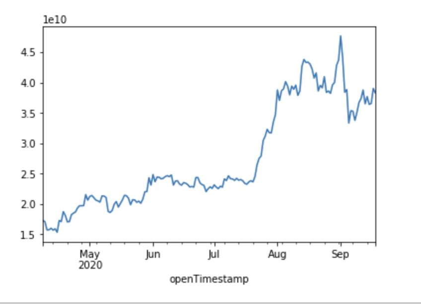

# chainlink_feeds

[](https://badge.fury.io/py/chainlink-feeds.svg)
[](http://isitmaintained.com/project/AlphaChainio/chainlink_feeds "Average time to resolve an issue")
[](http://isitmaintained.com/project/AlphaChainio/chainlink_feeds "Percentage of issues still open")
[](https://github.com/alphachainio/chainlink_feeds/actions?query=workflow%3Achainlink_feeds)

A way to pull data from the Chainlink Price Feeds for analytics, algorithmic trading models, or else.

This repo uses either an RPC_URL or the [Chainlink Subgraph](https://thegraph.com/explorer/subgraph/melonproject/chainlink)

# Quickstart

Install:

```
pip install chainlink_feeds
```

# Using the Chainlink subgraph

When you don't specify an RPC_URL, you automatically use the Chainlink subgraph.

```
from chainlink_feeds import ChainlinkFeeds

cf = ChainlinkFeeds()
print(cf.get_latest_round_data(pair='ETH_USD'))
```

Result:

```
[{'assetPair': 'ETH/USD', 'blockHash': '0x141ad3c7468f4263d8b1b98a73f804b40ef1eb3a966bc2151646a08ba9872a58', 'blockNumber': '10887253', 'id': '0xf79d6afbb6da890132f9d7c355e3015f15f3406f/10887253/8', 'price': '38281000000', 'timestamp': '1600446952', 'transactionHash': '0x44e321f415e2ae236e3fbfb0df024825ff95331dca89dd25401303f0433fdb9d'}]
```

```
You can also pass:
cf.get_historical_price()
cf.get_price_feeds()
cf.get_prices()
cf.get_hourly_candle()
cf.get_daily_candle()
cf.get_weekly_candle()
```

This will get you all the data the subgraph can return. If you'd like to get pandas, you can just change the output format of the object.

```
cf = ChainlinkFeeds(output_format = 'pandas')
data = cf.get_daily_candle(pair='eth/usd')
data['closePrice'] = data['closePrice'].astype(float)
data.index = pd.to_datetime(data.index, unit='s')
data['closePrice'].plot()
```

resulting in:

```
              assetPair averagePrice   closePrice    highPrice     lowPrice  medianPrice    openPrice
openTimestamp
1600387200      ETH/USD  38615230654  38281000000  39190413319  38110269640  38933749501  38933749501
1600300800      ETH/USD  37891000000  39020000000  39344406296  36503000000  36503000000  36503000000
1600214400      ETH/USD  36564000000  36555000000  37276742411  35743000000  36428000000  36428000000
1600128000      ETH/USD  36983000000  36385393883  38069814258  36319641931  37744000000  37744000000
1600041600      ETH/USD  36914207489  37675318623  38270000000  35817000000  36634540717  36634540717
...                 ...          ...          ...          ...          ...          ...          ...
1586649600      ETH/USD  16022887240  15994875000  16467921975  15597479550  15864014512  15864014512
1586563200      ETH/USD  15838000000  15738831997  16108625000  15543870740  15813418305  15813418305
1586476800      ETH/USD  15868349654  15729441133  16995863008  15328500000  16994301012  16994301012
1586390400      ETH/USD  16990152130  17075750000  17151190079  16863999644  16943041228  16943041228
1586304000      ETH/USD  17277450182  17276241069  17277853301  17276241069  17277853301  17277853301
```

You can then run some analytics on it:

```
from chainlink_feeds import ChainlinkFeeds
import matplotlib.pyplot as plt
import pandas as pd

cf = ChainlinkFeeds(output_format = 'pandas')
data = cf.get_daily_candle(pair='eth/usd')
data['closePrice'] = data['closePrice'].astype(float)
data.index = pd.to_datetime(data.index, unit='s')
data['closePrice'].plot()
```

Which results in:


You can also run your own GraphQL Query with:

```
cf.graphql_query("{enter_query_here}")
```

You can check out some methods on the [Chainlink subgraph](https://thegraph.com/explorer/subgraph/melonproject/chainlink) site.


# Using the RPC_URL

Otherwise you can specify an RPC_URL and query the blockchain yourself.

```
from chainlink_feeds import ChainlinkFeeds

cf = ChainlinkFeeds(rpc_url = "https://www.infura.com/asdfasdfasdfas)
```

And query the blockchain directly. You do need to know the address and the ABI of the pair. For reference, you can check the `config` folder in this repo. You can also `load_config` with your own config with addresses or ABIs. A lot of them are prepopulated in this repo, but be sure to check if you're using outdated addresses.

```
print(cf.get_latest_round_data(network='KOVAN', pair='ETH_USD'))
```

Resulting in:

```
{'round_id': 18446744073709562669, 'price': 382.66, 'started_at': '2020-09-18 13:30:12', 'time_stamp': '2020-09-18 13:30:12', 'answered_in_round': 18446744073709562669}
```

You can use the methods directly from the [Chainlink Price Feeds Documentation](https://docs.chain.link/docs/using-chainlink-reference-contracts).

# TODOs:

- Add more query support
- Make docs other than this readme
- add more tests
- figure out how to go back more than 1000 results

# Contact:

- [Alpha Chain Site](https://alphachain.io)
- [Medium](https://medium.com/@patrick.collins_58673)
- [YouTube](https://www.youtube.com/channel/UCn-3f8tw_E1jZvhuHatROwA?feature=emb_ch_name_ex)
- [Twitter](https://twitter.com/AlphaChainio)
- [Discord](https://discord.gg/jj8wQ9b)

Be sure to check out the [Chainlink Developers Discord](https://discord.gg/2YHSAey) as well!

Consider starring this repo if you enjoyed it :)
